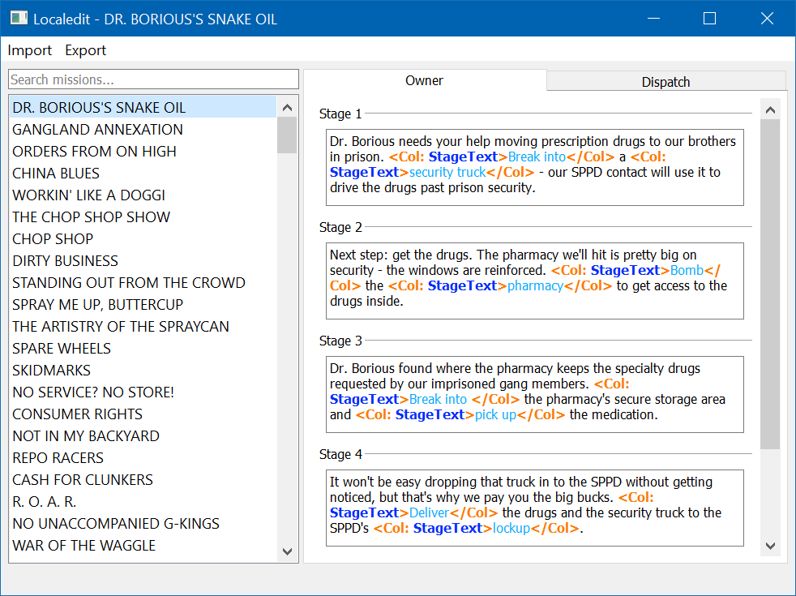

## Localedit
### A graphical editor for `MissionTemplates` and `TaskObjectives` files for the video game [APB Reloaded](http://gamersfirst.com/apb/)

#### Purpose
This graphical tool is intended to make editing localization files easier for the game
[APB Reloaded](http://gamersfirst.com/apb/). At the moment, the scope of the project only allows editing files such as
`MissionTemplates` and `TaskObjectives` of any language, provided their internal structure matches the default template.

#### Features:
* Syntax highlighting support of `<Col></Col>` tags;
* Searchable (by mission name and id) list of missions;
* Tabbed panel for editing opposing sides of a mission's objectives;
* Cross-platform (even though the game itself isn't, but that was not my goal)

You can import the entire contents of a folder and the program will find the required files, you don't have to look for
them yourself (as in, select the contents of the folder, not just the folder itself, there's a future TODO for me!).

To export your edited objectives and missions, you need only select the folder you want them to be in, however
it WILL likely overwrite or append to existing files, so I recommend being careful with that!

#### Downloads
##### Windows binaries
x64 binaries are in the Releases section of this repository.
